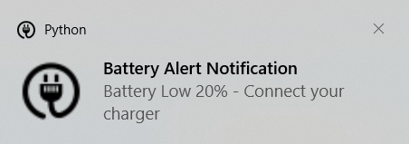
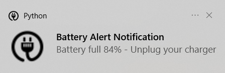
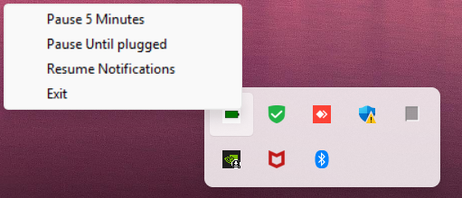

# 🔋 Battery Alert Notifier (Python)

A simple yet effective desktop notifier tool that monitors your battery percentage and alerts you when it's too low or fully charged. Helps extend battery health and avoid power surprises.

---

## ⚙️ Features

- 📢 Notification on full charge (above `maximum` %)
- 📢 Notification on low battery (below `minimum` %)
- 🛑 Pause alerts via system tray menu (5 minutes or until plugged)
- 📝 Logs all events with timestamps in date-wise folders
- ⚙️ Configurable thresholds and interval via `.env`
- ⏱️ Enforced minimum interval of 30 seconds to avoid spamming
- 🖼️ Custom tray icon with right-click menu
- 💻 Works silently in the background with minimal resource usage

---

## 🧪 How to Use

### 1. Clone the Repo

```bash
git clone https://github.com/raquib-dev/battery-alert-notifier.git
cd battery-alert-notifier
```

### 2. Install Requirements

```bash
pip install -r requirements.txt
```

### 3. Create a `.env` file (optional)

```ini
# Battery percentage at which to alert for full charge
maximum=90

# Battery percentage at which to alert for low battery
minimum=20

# Time interval (in seconds) to check battery status
# Minimum allowed: 30 (auto-enforced)
interval=15
```

### 4. Run the App

```bash
python BatteryPercentage.py
```

---

## 🛠 Tech Stack

- `Python 3.10+`
- `psutil` – For accessing battery statistics
- `winotify` – For native Windows toast notifications
- `pystray` – For creating a system tray icon and menu
- `Pillow (PIL)` – For drawing the tray icon
- `python-dotenv` – For reading environment variables from `.env` files


---

## 📁 Project Structure

```
.
├── BatteryPercentage.py
├── logo.ico
├── requirements.txt
├── .env
├── Log/
└── .gitignore
```

---

## 📸 Screenshots

### 🔋 Low Battery Alert


### 🔌 Full Charge Alert


### 🧰 Tray Menu with Pause Options


---

## ✅ Use Cases

- Prevent overcharging laptop batteries
- Avoid sudden shutdowns due to low battery
- Quiet background notifier with logs
- Temporarily disable alerts when not needed

---

## 🧹 Log Retention

- Logs are stored in `Log/{dd-mm-yyyy}/`
- Automatically deletes logs older than 5 days

---

## ✨ New in This Version

- Added system tray icon with right-click menu options
- Menu options: Pause for 5 minutes, Pause until plugged, Resume alerts
- Improved compatibility using `winotify` (native Windows notifications)
- Prevented overlapping notifications during tray interaction
- Enforced a minimum interval of 30 seconds
- Added helpful inline comments to `.env` for clarity

---

## 🚀 Tip

Package it with `pyinstaller` to run as a background Windows/Linux/Tray App:

```bash
pyinstaller --onefile --windowed BatteryPercentage.py --icon=logo.ico
```
